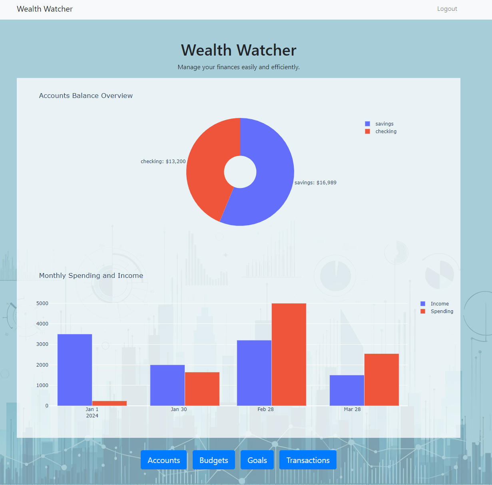
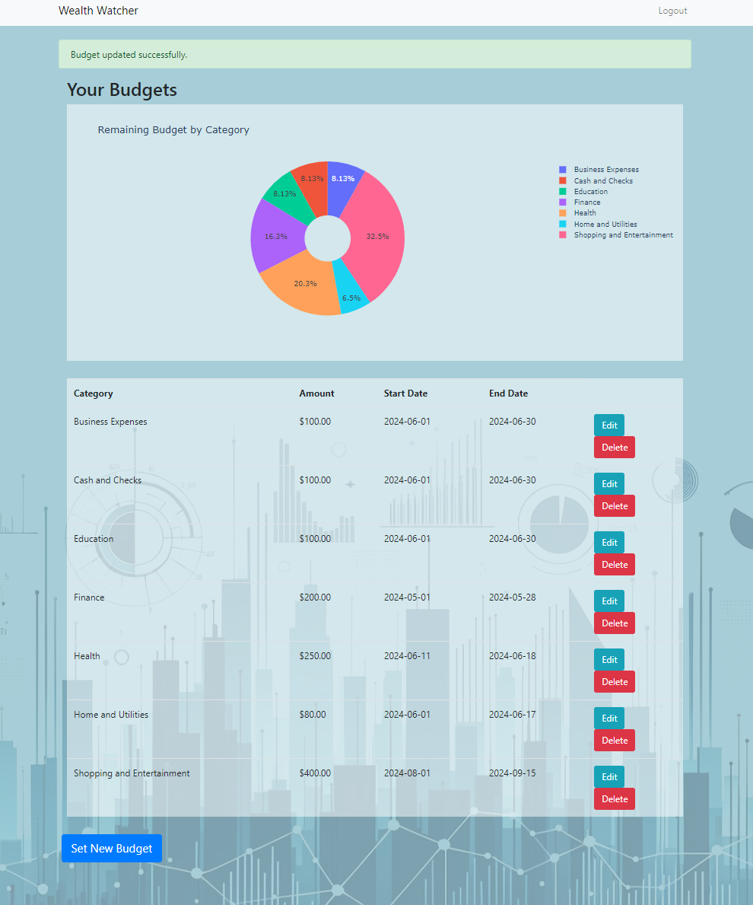
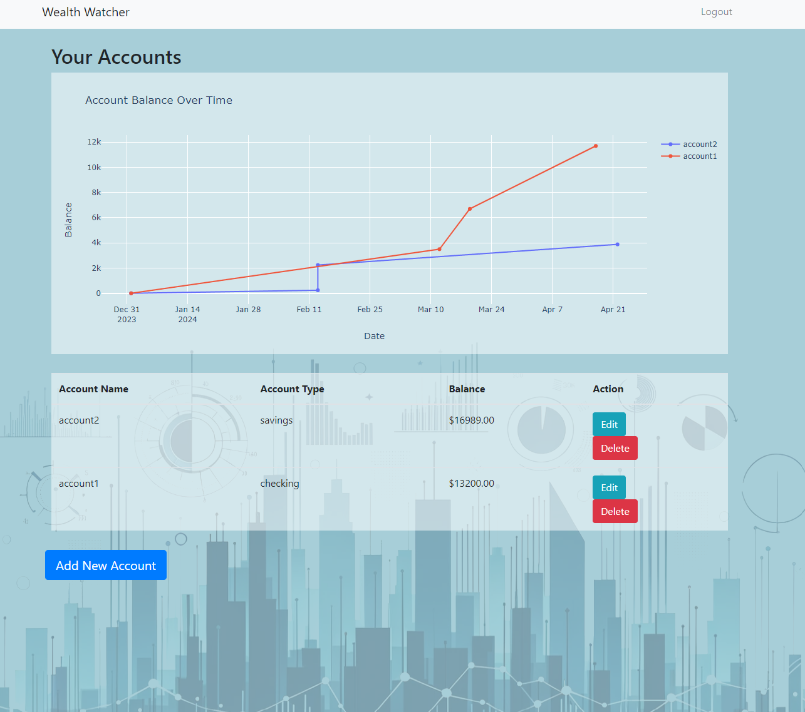

##  Wealth Watcher  ##

Wealth Watcher is a comprehensive web application designed to help users manage their personal finances efficiently. The application provides a user-friendly interface for tracking budgets, expenses, accounts, and financial goals. Built using Flask for the back-end, SQLAlchemy for database management, and Plotly for data visualization, Wealth Watcher empowers users with insightful financial data and visualizations.

**The Website Link:**
[https://financemanager-main.onrender.com/](https://financemanager-main.onrender.com/)

**Key Features**

- **User Authentication:** Secure user registration and login functionalities.
- **Account Management:** Users can add, edit, and delete their bank accounts.
- **Budget Tracking:** Users can set, edit, and delete budgets for various categories.
- **Transaction Management:** Users can log income and expenses, categorized for detailed tracking.
- **Goal Setting:** Users can set and track financial goals.
- **Data Visualization:** Interactive charts displaying account balances over time, monthly spending and income, and remaining budget by category.

**Technologies Used**

- **Flask:** Web framework for building the application backend.
- **SQLAlchemy:** ORM for database management.
- **Plotly:** Library for creating interactive charts and visualizations.
- **HTML/CSS:** For building the frontend interface.
- **JavaScript:** Used minimally to enhance certain user interactions.
- **Bootstrap:** For responsive and modern UI design.

**Data and Functionality**

The application uses a PostgreSQL database to store all user data, including accounts, budgets, transactions, and goals. Data is retrieved and visualized through dynamic charts to provide users with clear insights into their financial status.

**Screenshots**

- **Dashboard:** Overview of accounts balance, monthly spending, and income.

- **Budgets Page:** Detailed view of user budgets and remaining amounts by category.

- **Accounts Page:** Detailed view of user accounts and their balances over time.

**App Features Include**

1. **User Authentication:**

	- Secure login and registration.
	- Session management to ensure user data security.
 
2. **Account Management:**

	- 	Add new bank accounts with initial balances.
	- 	Edit account details.
	- 	Delete accounts when no longer needed.

3. **Budget Tracking:**

	- Set budgets for various categories (e.g., Business Expenses, Cash and Checks, Education).
	- Edit existing budgets.
	- Delete budgets that are no longer needed.
4. **Transaction Management:**

	- Add transactions, specifying the type (income or expense), category, description, and date.
	- Edit existing transactions to correct any errors.
	- Delete transactions if necessary.
5. **Goal Setting:**

	- Set financial goals with target amounts.
	- Track progress towards achieving these goals.
	- Edit and delete goals as needed.
6. **Data Visualization:**

	- Interactive pie charts showing remaining budget by category.
	- Bar charts illustrating monthly spending and income.
	- Line charts tracking account balances over time.

**Resources Used:**

- **Data:** User-generated financial data.
- **Technology Stack:** Flask, SQLAlchemy, Plotly, HTML, CSS, JavaScript, Bootstrap.

**Conclusion**

Wealth Watcher is a powerful tool for managing personal finances, offering detailed insights and easy-to-use features for tracking budgets, accounts, transactions, and financial goals. The combination of Flask, SQLAlchemy, and Plotly provides a robust backend and interactive front-end, making financial management accessible and efficient.